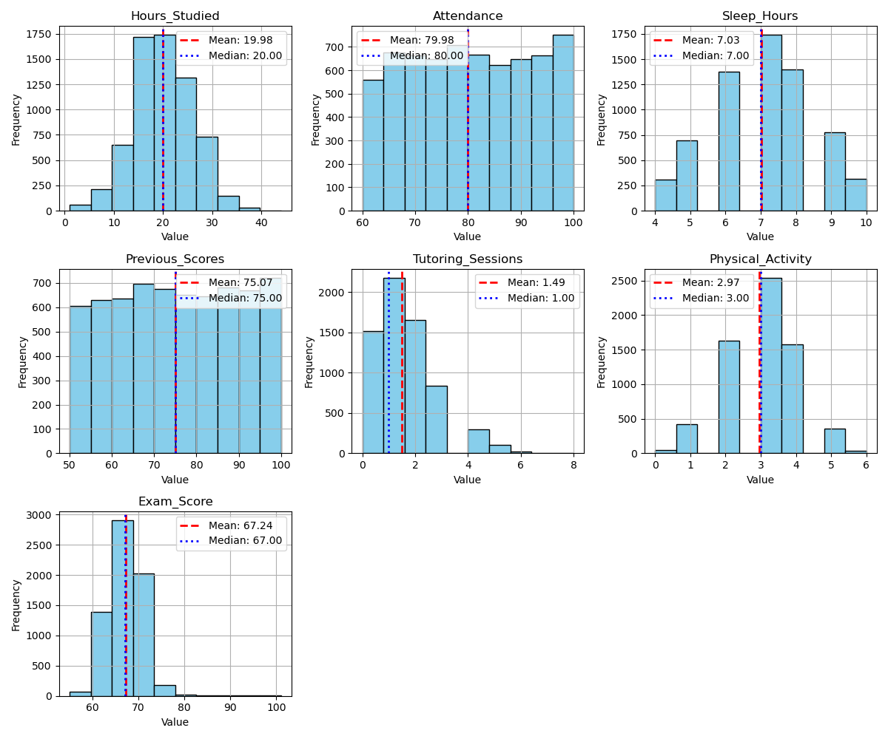

# Summary Report

## Dataset Overview

This dataset provides a comprehensive overview of various factors affecting student performance in exams.

### First 5 Rows of the Dataset

|    |   Hours_Studied |   Attendance | Parental_Involvement   | Access_to_Resources   | Extracurricular_Activities   |   Sleep_Hours |   Previous_Scores | Motivation_Level   | Internet_Access   |   Tutoring_Sessions | Family_Income   | Teacher_Quality   | School_Type   | Peer_Influence   |   Physical_Activity | Learning_Disabilities   | Parental_Education_Level   | Distance_from_Home   | Gender   |   Exam_Score |
|---:|----------------:|-------------:|:-----------------------|:----------------------|:-----------------------------|--------------:|------------------:|:-------------------|:------------------|--------------------:|:----------------|:------------------|:--------------|:-----------------|--------------------:|:------------------------|:---------------------------|:---------------------|:---------|-------------:|
|  0 |              23 |           84 | Low                    | High                  | No                           |             7 |                73 | Low                | Yes               |                   0 | Low             | Medium            | Public        | Positive         |                   3 | No                      | High School                | Near                 | Male     |           67 |
|  1 |              19 |           64 | Low                    | Medium                | No                           |             8 |                59 | Low                | Yes               |                   2 | Medium          | Medium            | Public        | Negative         |                   4 | No                      | College                    | Moderate             | Female   |           61 |
|  2 |              24 |           98 | Medium                 | Medium                | Yes                          |             7 |                91 | Medium             | Yes               |                   2 | Medium          | Medium            | Public        | Neutral          |                   4 | No                      | Postgraduate               | Near                 | Male     |           74 |
|  3 |              29 |           89 | Low                    | Medium                | Yes                          |             8 |                98 | Medium             | Yes               |                   1 | Medium          | Medium            | Public        | Negative         |                   4 | No                      | High School                | Moderate             | Male     |           71 |
|  4 |              19 |           92 | Medium                 | Medium                | Yes                          |             6 |                65 | Medium             | Yes               |                   3 | Medium          | High              | Public        | Neutral          |                   4 | No                      | College                    | Near                 | Female   |           70 |

## Summary Statistics

|        |   Hours_Studied |   Attendance |   Sleep_Hours |   Previous_Scores |   Tutoring_Sessions |   Physical_Activity |   Exam_Score |
|:-------|----------------:|-------------:|--------------:|------------------:|--------------------:|--------------------:|-------------:|
| mean   |        19.9753  |      79.9774 |       7.02906 |           75.0705 |             1.49372 |             2.96761 |     67.2357  |
| median |        20       |      80      |       7       |           75      |             1       |             3       |     67       |
| std    |         5.99059 |      11.5475 |       1.46812 |           14.3998 |             1.23057 |             1.03123 |      3.89046 |

## Data Visualization

